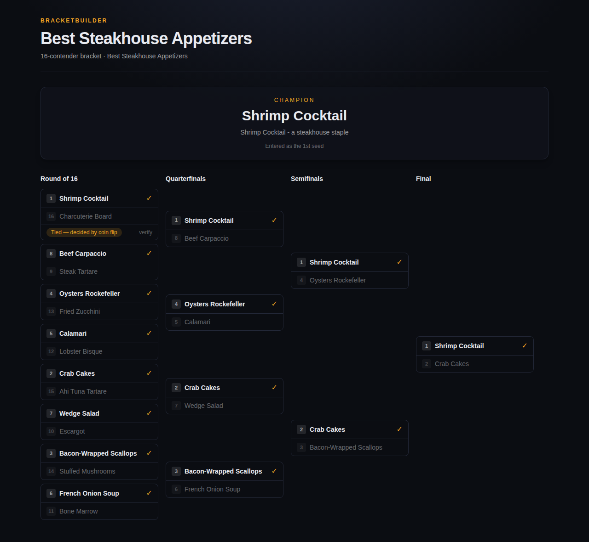
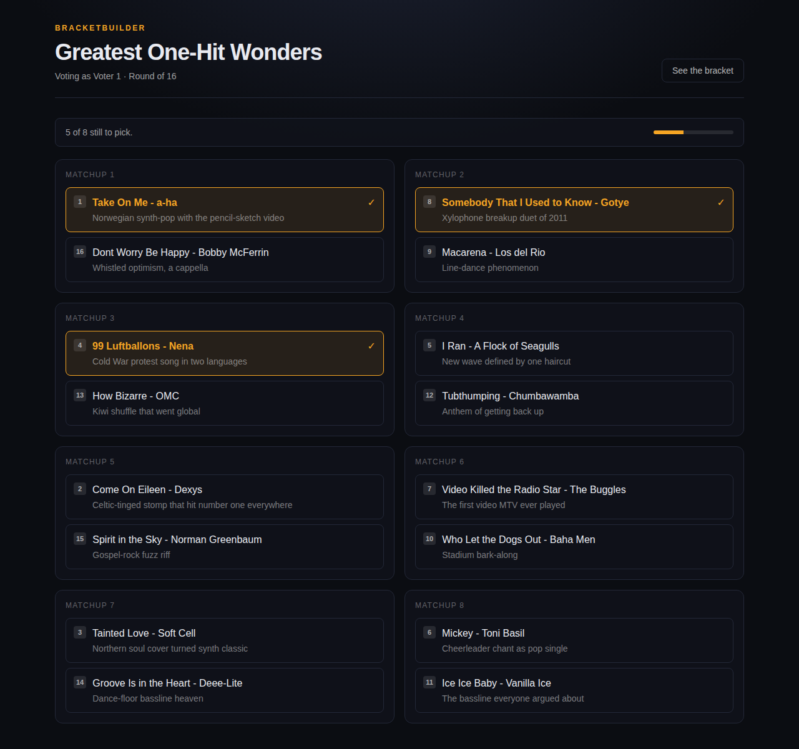

# BracketBuilder

Build a bracket for any category, let Claude research and seed the field, then
have an invited group vote it out round by round.

Name a category — *Best Steakhouse Appetizers* — and the app researches the
contenders, ranks them by how likely they are to win a popular vote, and seeds
them so the predicted favorites open against the weakest of the field. You hand
out one private link per voter. Each round, everyone picks; you close the round
and the winners advance. Ties are broken by a coin flip that was committed to
before any vote was cast.



## How it works

**Seeding.** Candidates come back from research ranked strongest first, and that
order is the seeding. Pairings follow the standard bracket construction, so
every opening matchup pairs seeds that sum to *size + 1* (1v16, 8v9, …) and the
top two seeds cannot meet before the final. If a category yields fewer
candidates than the bracket holds, the missing seeds are the weakest ones and
the byes fall to the strongest entrants.

**Voting.** There are no accounts. Each voter gets a link carrying a 192-bit
token; following it exchanges the token for an httpOnly cookie scoped to that
bracket. One vote per person per matchup is enforced by a unique database index,
not by application logic, so a double-submit cannot produce a second ballot.
Voters can change a pick while the round is open.

Running tallies are hidden from voters while a round is open — nobody votes with
the scoreboard in view — and become public once a matchup is decided.

The admin console shows turnout for the round in progress ("3 of 5 voted", plus
how many are partway through or haven't started) and per matchup, so you can see
whether closing now would cut anyone off. Turnout says how many ballots are in,
never which way they went, but it's gated to the admin alongside the tallies.

**Tie-breaks.** A tie (including a matchup nobody voted in) is broken by a coin
flip, using a commit-reveal scheme rather than a `Math.random()` at close time:

1. When a matchup is created — before any vote exists — a random 32-byte seed is
   generated and only its hash is stored publicly.
2. On a tie, the winning side is derived from that seed by a fixed rule. It was
   fixed before voting opened, so no one can influence or re-roll it.
3. The seed is revealed once the matchup is decided. Anyone can check that it
   matches the published commitment and that the stated winner follows the rule.

The bracket view exposes both values with a "verify" toggle. To recheck by hand:

```
commitment = sha256("bracketbuilder/commit/v1|" + seed)
winner     = low bit of sha256("bracketbuilder/flip/v1|" + seed)   # 0 = top slot
```



## Getting started

Requires Node 20+ and a Postgres database.

```bash
npm install
cp .env.example .env      # DATABASE_URL is required; ANTHROPIC_API_KEY is optional
npm run db:push           # create the tables
npm run dev
```

Without `ANTHROPIC_API_KEY` the app still works — the admin console lets you type
the field in by hand, one contender per line.

Open http://localhost:3000, create a bracket, and the admin console walks you
through researching candidates, inviting voters, and running the rounds.

### Environment

| Variable | Required | Purpose |
| --- | --- | --- |
| `DATABASE_URL` | yes | Postgres connection string. |
| `ANTHROPIC_API_KEY` | for research | Used to research and seed candidates. Without it you can still enter candidates by hand. |
| `RESEARCH_WEB_SEARCH` | no | `false` skips live web search and relies on the model's own knowledge — cheaper and faster, less current. Defaults to on. |
| `APP_URL` | no | Forces the origin used in invite links. Leave unset on a normal deploy — the app reads the real host from the request. |

Research uses `claude-opus-5` in two stages: a web-search pass that gathers
evidence about the category, then a schema-constrained pass that turns those
notes into a ranked list.

Cost lands around 25-50 cents per bracket created (not per vote) with web search
on, since up to eight searches' worth of results pass through the context
window. Setting `RESEARCH_WEB_SEARCH=false` drops that to a few cents by relying
on the model's own knowledge instead. Note that API credits are billed
separately from any Claude subscription.

## Running a bracket

1. **Create** — pick a category and a size (16, 32, 64 or 128).
2. **Seed** — run the research. Review the candidates and their rationales; re-run
   if you don't like the field. Nothing is locked in until you start.
3. **Invite** — generate one link per voter and send them out.
4. **Vote** — invited voters pick a side in every open matchup.
5. **Close the round** — tallies are counted, ties are flipped, winners advance,
   and the next round opens automatically. Repeat to the final.

An even number of voters is fine: ties are expected and handled.

## Tests

```bash
npm run test:unit    # bracket math and the coin flip - no database needed
npm test             # the above plus integration tests against DATABASE_URL
```

The integration suite runs a full tournament against a real Postgres, covering
seeding, byes, upsets, ties resolved by flip, and the one-vote-per-person index.
It deletes all brackets in the target database between tests — point
`DATABASE_URL` at a scratch database, not one with brackets you care about.

## Deploying

Any host that runs Next.js server-side works. On Vercel, import the repo and
attach a Postgres database (Neon, Supabase) so `DATABASE_URL` is set — that is
the only required variable. `npm run build` runs `prisma generate` and
`prisma db push`, so the deploy creates its own tables; there is no separate
setup step. `ANTHROPIC_API_KEY` can be added later to turn research on.

Because the build pushes the schema, a deploy whose schema change would drop
data fails rather than dropping it. Use a real migration (`prisma migrate`) once
you have brackets worth keeping.

## Layout

```
prisma/schema.prisma     Bracket, Candidate, Matchup, Voter, Vote
src/lib/bracket.ts       seeding order, pairings, byes, advancement (pure)
src/lib/coinflip.ts      commit-reveal tie-break
src/lib/research.ts      Claude research and ranking
src/lib/service.ts       building a bracket, closing rounds, casting votes
src/lib/view.ts          read model for the pages
src/app/                 pages and API routes
```
